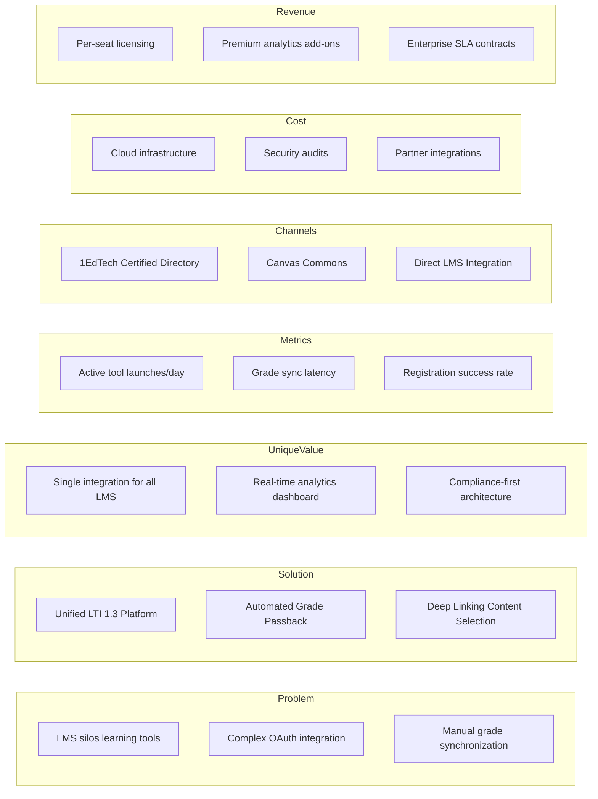
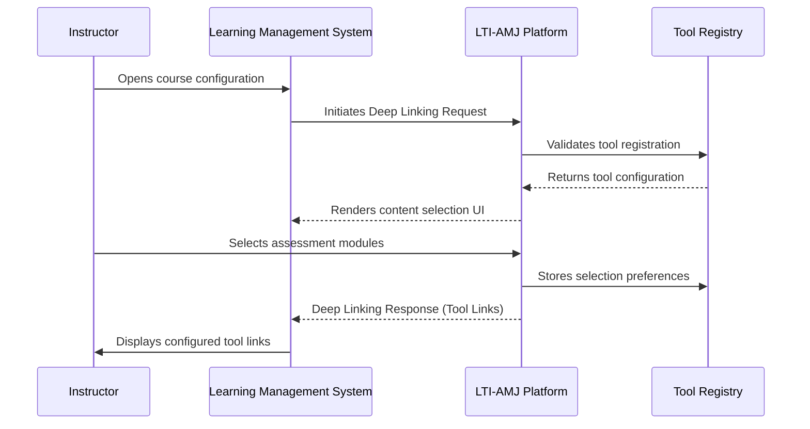
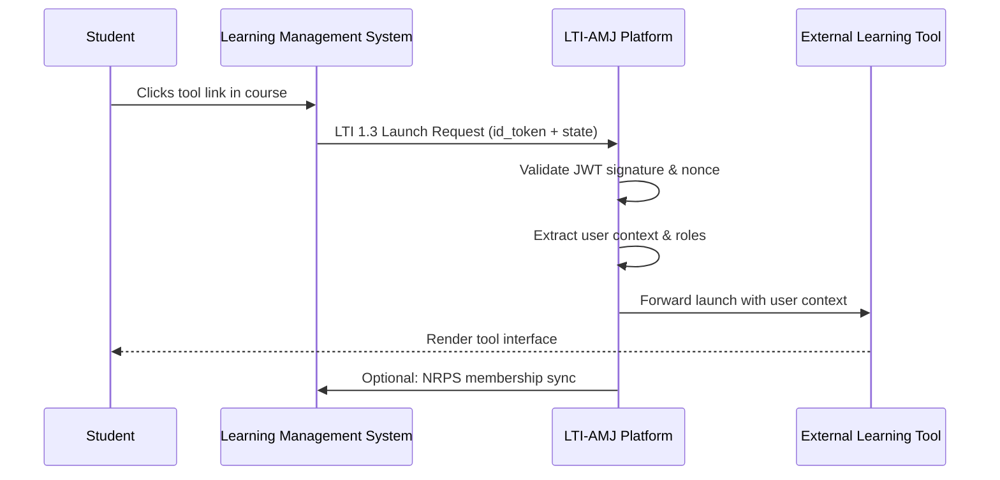
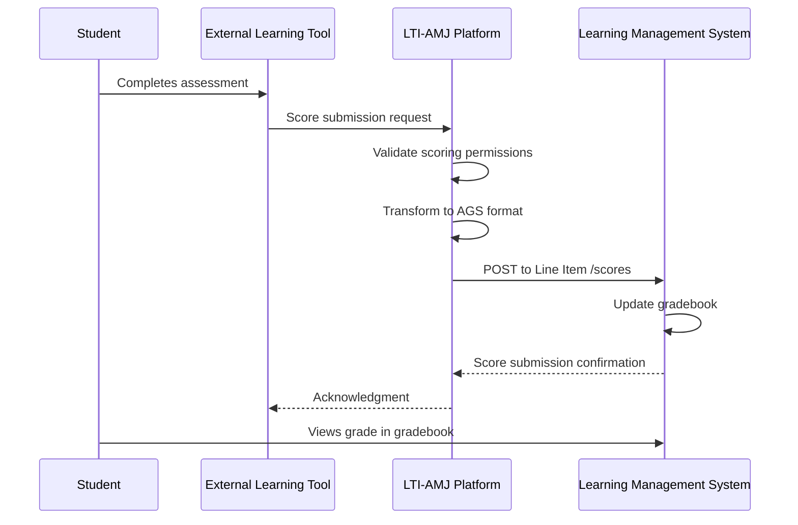
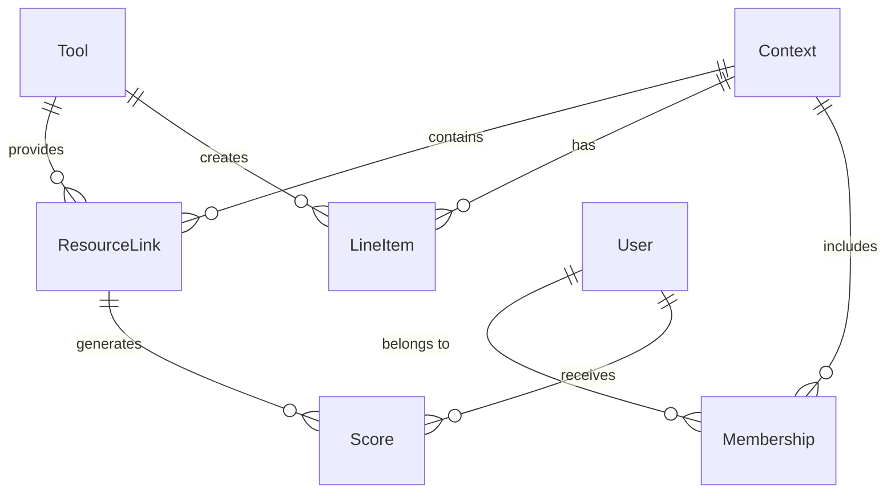
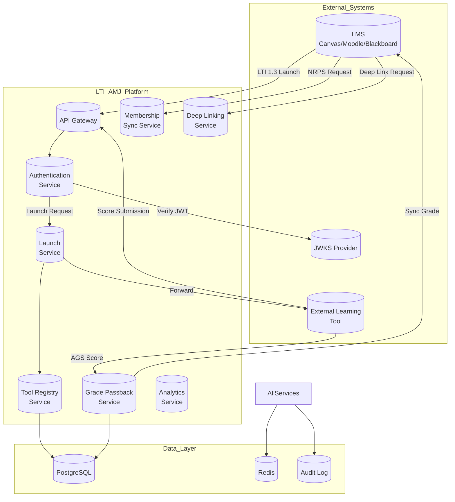
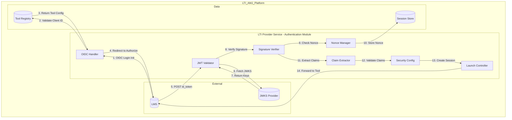

# LTI-AMJ: Learning Tools Interoperability Platform v1

**Version:** 1.0  
**Date:** 2026-04-13  
**Status:** Architecture Specification Document

---

## 1. Product Overview

LTI-AMJ (Advanced Learning Tools Interoperability) is a next-generation LTI-compliant platform designed to provide seamless integration between external learning tools and Learning Management Systems (LMS) such as Canvas, Moodle, and Blackboard.

### Added Value for the EdTech Ecosystem

- **Unified Integration Framework:** Single API surface for connecting diverse learning tools across multiple LMS platforms
- **Standardized Data Exchange:** Full compliance with 1EdTech LTI Advantage specification
- **Enhanced Security:** OAuth2/OIDC based authentication with JWT token validation
- **Real-time Analytics:** Built-in usage tracking and learning outcome metrics

### Competitive Advantages

| Advantage | Description |
|-----------|-------------|
| Security | Platform-level OAuth2/OIDC flow with nonce validation and signature verification |
| Ease of Integration | Pre-built launch handlers and standardized registration workflows |
| Data Analytics | Native Grade Passback, Deep Linking, and Names and Roles Provisioning Services |
| Scalability | Cloud-native microservices architecture with horizontal scaling |
| Compliance | Full LTI 1.3 / LTI Advantage support |

---

## 2. Core Functionality

### LTI Advantage Support

LTI-AMJ implements all three LTI Advantage services:

1. **Assignment and Grade Services (AGS):** Enables reading, creating, and updating line items and scores
2. **Names and Role Provisioning Services (NRPS):** Provides membership data sync between LMS and tools
3. **Deep Linking (DL):** Allows instructors to select and configure content from external tools

### Deep Linking Workflow

1. LMS sends a Deep Linking Request with JWT containing launch context
2. LTI-AMJ validates the request and presents available resources
3. User selects resources and submits selections
4. LTI-AMJ returns selected items as a Deep Linking Response
5. LMS creates corresponding Tool Links in the course

### Grade Passback

1. External tool collects assessment data
2. LTI-AMJ receives score submission via AGS API
3. Platform validates score against configured grading schema
4. Score is pushed back to LMS gradebook via Line Item endpoint
5. Student sees synchronized grade in their LMS

---

## 3. Lean Canvas

---

## 4. Use Cases

### Use Case 1: Instructor Tool Setup

**Description:** An instructor configures an external tool (e.g., a coding assessment platform) within their LMS course using Deep Linking.

### Use Case 2: Student Tool Access

**Description:** A student launches an external tool from within their LMS course.

### Use Case 3: Automatic Grading

**Description:** An external tool submits assessment scores back to the LMS gradebook automatically.

---

## 5. Data Model

### Entities

| Entity | Attributes | Type | Constraints |
|--------|------------|------|-------------|
| **User** | id, lms_user_id, email, name, given_name, family_name, roles | UUID, String, String, String, String, String, String[] | PK, Unique per LMS |
| **Context** | id, lms_context_id, title, type, lms_id | UUID, String, String, String, UUID | PK, FK to LMS |
| **Tool** | id, client_id, deployment_id, name, description, public_key, jwks_url, initiator_oidc_url, target_link_uri | UUID, String, String, String, Text, String, String, String, String | PK, Unique (client_id + deployment_id) |
| **ResourceLink** | id, tool_id, context_id, resource_link_id, title, url, custom_params | UUID, UUID, UUID, String, String, String, JSON | PK, FK to Tool, Context |
| **Score** | id, resource_link_id, user_id, score_given, score_maximum, activity_progress, grading_progress, comment, timestamp, is_final | UUID, UUID, UUID, Decimal, Decimal, String, String, String, DateTime, Boolean | PK, FK to ResourceLink, User |
| **LineItem** | id, tool_id, context_id, line_item_id, label, score_maximum, resource_id, tag | UUID, UUID, UUID, String, String, Decimal, String, String | PK, FK to Tool, Context |
| **Membership** | id, context_id, user_id, status, roles | UUID, UUID, UUID, String, String[] | PK, FK to Context, User |

### Relationships

---

## 6. High-Level System Design

### Architectural Approach

LTI-AMJ follows a **cloud-native microservices architecture** designed for horizontal scalability and high availability.

| Characteristic | Implementation |
|----------------|-----------------|
| Deployment | Kubernetes on AWS/GCP |
| Communication | REST APIs with async message queues |
| Database | PostgreSQL (relational), Redis (caching) |
| Authentication | OAuth2/OIDC with JWT |
| Observability | Prometheus, Grafana, ELK Stack |

### C1 System Context Diagram

---

## 7. C4 Diagram - Component Level

### LTI Provider Service (Authentication Module)

This component is the "heart" of LTI security, handling OAuth2/OIDC flow, JWT validation, and launch request processing.

### Component Responsibilities

| Component | Responsibility |
|-----------|---------------|
| OIDC Handler | Processes OIDC login initiation, validates client registration, generates authorization redirect |
| JWT Validator | Validates JWT structure, expiry, issuer, audience |
| Signature Verifier | Verifies JWT signature against JWKS from LMS |
| Nonce Manager | Manages one-time use nonces to prevent replay attacks |
| Claim Extractor | Extracts user identity, context, roles, and resource link from LTI claims |
| Launch Controller | Creates session, generates launch response, redirects to tool |
| Security Config | Enforces security policies (allowed domains, required scopes) |

---

## 8. Compliance & Standards

LTI-AMJ is designed for full compliance with:

- **LTI 1.3 / LTI Advantage** (1EdTech)
- **OAuth 2.0** (RFC 6749)
- **OpenID Connect Core** (RFC 8252)
- **JWT** (RFC 7519)
- **IMS Global Security Best Practices**

---

*Document Version: 1.0 | Architecture by Senior Software Architect*
