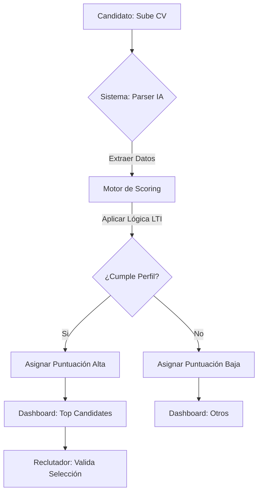
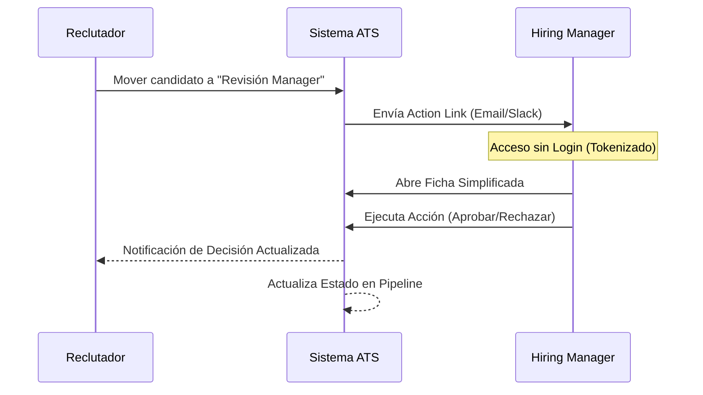
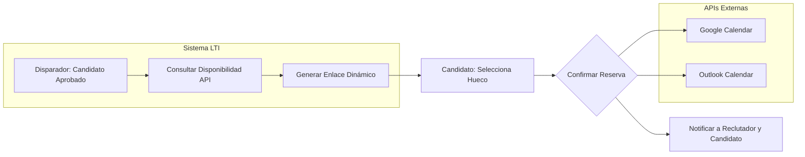
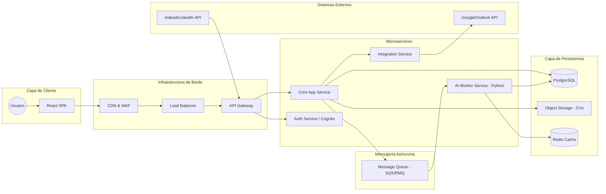

# ATS LTI v1

# Documentación Base: LTI-ATS (Applicant Tracking System)

**Empresa:** LTI  
**Responsable:** CEO - División de Estrategia de Talento  
**Objetivo:** Definición funcional para el desarrollo de software

---

## 1. Descripción del Sistema
El **LTI-ATS** es una plataforma integral de gestión de talento diseñada para transformar el reclutamiento reactivo en una estrategia de adquisición de talento proactiva. El sistema centraliza todo el flujo de trabajo, desde la detección de la necesidad de una vacante hasta la firma del contrato, integrando herramientas de comunicación, evaluación y análisis de datos en una única interfaz.

## 2. Valor Añadido
El valor de este software no reside en el almacenamiento de datos, sino en la **optimización operativa**:

* **Reducción de carga administrativa:** Automatización de la criba curricular (screening) mediante criterios predefinidos y flujos de trabajo programables.
* **Colaboración Síncrona:** Permite que los *Hiring Managers* y el equipo de RR. HH. compartan feedback, califiquen candidatos y tomen decisiones en tiempo real, eliminando los hilos de correos interminables.
* **Mejora de la Marca Empleadora (Employer Branding):** Comunicación automática y personalizada con el candidato en cada etapa, garantizando una experiencia profesional independientemente del resultado del proceso.

## 3. Ventaja Competitiva
LTI-ATS se diferencia de las soluciones genéricas del mercado por tres pilares críticos:

1.  **Algoritmo de Matching por Competencias:** A diferencia de la búsqueda tradicional por palabras clave, nuestro sistema utiliza un motor de análisis que pondera la experiencia y las habilidades técnicas frente a los requisitos críticos del puesto, ordenando a los candidatos por idoneidad real.
2.  **Interfaz "User-Centric" para el Negocio:** Diseñado específicamente para que los directores de otros departamentos (no expertos en RR. HH.) puedan utilizar la herramienta sin formación previa, facilitando la adopción interna.
3.  **Analítica de Reclutamiento Predictiva:** El sistema no solo ofrece métricas históricas (tiempo de contratación, coste por posición), sino que identifica cuellos de botella en el embudo de selección y sugiere los canales de publicación más efectivos según el perfil.
4.  **Arquitectura Abierta:** Capacidad de integración total vía API con herramientas de productividad (Slack, Microsoft Teams, Google Workspace) y sistemas de gestión de nóminas (ERP/HRIS) existentes.

---

## 4. Requerimientos Funcionales Prioritarios
* **Módulo de Multi-posting:** Publicación en múltiples portales de empleo y redes sociales con un solo clic.
* **Portal del Candidato:** Registro simplificado y seguimiento del estado de su candidatura.
* **Gestión de Entrevistas:** Sincronización de calendarios y sala virtual integrada.
* **Base de Datos Inteligente:** Etiquetado automático y búsqueda avanzada en el histórico de candidatos para futuras vacantes.
- Riesgo: exceso de configuración al inicio, mitigación: plantillas de pipeline por tipo de vacante.
- Riesgo: baja adopción por hiring managers, mitigación: UX muy simple para feedback y notificaciones accionables.
- Riesgo: IA poco fiable, mitigación: siempre como recomendación explicable y nunca como decisión final automática.
- Riesgo: datos duplicados de candidatos, mitigación: lógica fuerte de deduplicación y merge asistido.


# Especificaciones Funcionales: LTI-ATS

**Documento de Definición de Producto** **Responsable:** CEO LTI  
**Alcance:** Funcionalidades Core del Sistema

---

## 1. Gestión de Vacantes y Multidifusión
* **Multiposting:** Publicación simultánea en portales de empleo (LinkedIn, Indeed, portales locales) y redes sociales desde una única interfaz.
* **Generador de Job Descriptions:** Plantillas optimizadas para SEO y cumplimiento de diversidad e inclusión.
* **Gestión de Referidos:** Módulo interno para que los empleados recomienden candidatos, con seguimiento de bonificaciones.

## 2. Motor de Cribado Inteligente (Smart Screening)
* **CV Parsing:** Extracción de datos mediante IA para convertir currículums (PDF, Docx) en fichas de candidato estandarizadas.
* **Ranking Automático:** Algoritmo de puntuación que clasifica a los candidatos según su ajuste con los requisitos técnicos y competencias del puesto.
* **Cuestionarios de Filtro (Killer Questions):** Preguntas de descarte automático para agilizar la criba inicial.

## 3. Pipeline de Selección Dinámico
* **Flujos Personalizables:** Configuración de etapas por arrastrar y soltar (Drag & Drop) adaptadas a diferentes tipos de perfiles (IT, Operaciones, Directivos).
* **Automatización de Acciones:** Programación de cambios de estado automáticos (ej. envío de test técnico al pasar a la fase de "Evaluación").

## 4. Portal del Hiring Manager
* **Interfaz Simplificada:** Acceso específico para los jefes de departamento para revisar candidatos preseleccionados sin necesidad de formación técnica.
* **Scorecards de Entrevista:** Formularios de evaluación unificados para que todos los entrevistadores midan los mismos criterios, eliminando sesgos subjetivos.
* **Sistema de Feedback:** Hilos de comentarios y menciones en la ficha del candidato para decisiones colaborativas rápidas.

## 5. Comunicación y Experiencia del Candidato
* **Agendación Automatizada:** Sincronización con Google Calendar y Outlook para que el candidato elija su propio hueco de entrevista según la disponibilidad del reclutador.
* **Gestión de Plantillas:** Envío masivo de comunicaciones personalizadas para informar sobre el estado de la candidatura, evitando el "vacío de información".
* **Portal del Candidato:** Espacio para que el postulante gestione sus datos y consulte el progreso de su proceso.

## 6. Base de Datos y Talent Nurturing
* **Búsqueda Booleana y Semántica:** Filtros avanzados para localizar talento dentro de la base de datos histórica.
* **Etiquetado Inteligente:** Segmentación por habilidades, ubicación y expectativas salariales para crear pools de talento "en reserva".

## 7. Analítica de Reclutamiento (Business Intelligence)
* **Cuadros de Mando en Vivo:** Visualización de KPIs clave: *Time-to-hire*, *Cost-per-hire* y ratio de conversión por etapa.
* **Informes de Origen:** Análisis de qué portales o canales aportan los candidatos de mayor calidad para optimizar la inversión en publicidad.
* **Auditoría de Procesos:** Seguimiento de tiempos de respuesta de los reclutadores y managers para detectar cuellos de botella.

# Lean Canvas: LTI-ATS

**Proyecto:** LTI (Applicant Tracking System)  
**Visión:** Optimización del ROI del talento mediante eficiencia operativa.

| **PROBLEMA** | **SOLUCIÓN** | **PROPUESTA ÚNICA DE VALOR (UVP)** | **VENTAJA ESPECIAL** | **SEGMENTOS DE CLIENTE** |
| :--- | :--- | :--- | :--- | :--- |
| **Pérdida de talento crítico:** Candidatos *top* que abandonan procesos por falta de agilidad. | **Ranking Predictivo:** Algoritmo que puntúa candidatos por competencias reales, no solo palabras clave. | **"Reduzca el coste de vacante abierta y recupere la agilidad operativa con el único ATS diseñado por expertos en personas."** | **HR Pedigree:** Lógica de software basada en 20 años de dirección real de RR. HH., no solo en código técnico. | **Mid-Market & Enterprise:** Empresas (200-2.000 empleados) con volumen de contratación recurrente. |
| **Coste de vacante abierta:** Impacto financiero diario por posiciones estratégicas sin cubrir. | **Interfaz "Zero-Training":** Panel simplificado para que los jefes de área decidan en segundos. | *Para el CFO:* Reducción drástica del Time-to-Fill y gastos en agencias. | | **Empresas en Hipercrecimiento:** Startups y scaleups que necesitan escalar equipo sin burocracia. |
| **Fricción RR. HH. - Negocio:** Herramientas complejas que los managers rechazan utilizar. | **Workflows Automatizados:** Eliminación de tareas administrativas (agendas, correos) para priorizar la evaluación. | *Para el Reclutador:* Herramienta que elimina el "trabajo basura" y facilita la colaboración. | | **Consultoras de Selección:** Firmas que necesitan un diferencial tecnológico para sus clientes. |
| **MÉTRICAS CLAVE** | | **CANALES** | | |
| **Time-to-Fill:** Reducción del tiempo medio de contratación. | | **Alianzas Estratégicas:** Consultoras de *Interim Management* y asociaciones de directivos de RR. HH. | | |
| **Ratio de Adopción del Manager:** % de responsables que usan el sistema de forma autónoma. | | **Liderazgo de Pensamiento:** White papers sobre el impacto financiero de la gestión de talento. | | |
| **Calidad de Contratación:** Tasa de permanencia del candidato tras el primer año. | | **Venta Consultiva B2B:** Prospección directa enfocada en resolver problemas operativos específicos. | | |
| **ESTRUCTURA DE COSTES** | | **FLUJO DE INGRESOS** | | |
| **I+D y Desarrollo:** Mantenimiento de infraestructura Cloud y evolución del algoritmo. | | **Suscripción SaaS:** Ingresos recurrentes por vacantes activas o número de licencias. | | |
| **Customer Success:** Implementación y soporte para asegurar la adopción interna. | | **Implementation Fees:** Configuración inicial e integración con ERP/Payroll. | | |
| **Marketing B2B:** Eventos sectoriales y contenido técnico para perfiles C-Level. | | **Módulos Premium:** Analítica avanzada, informes de diversidad y auditoría de procesos. | | |


# Especificaciones Técnicas: Casos de Uso LTI-ATS

**Documento de Producto** | **Versión:** 1.0  
**Autor:** Senior Technical Product Manager  
**Estado:** Para Revisión de Ingeniería

---

## UC1: Cribado Inteligente e Identificación de Candidatos Top
**Objetivo:** Automatizar la priorización de talento utilizando el algoritmo de "HR Pedigree".

* **Actores:** * **Primario:** Reclutador.
    * **Secundarios:** Motor de IA (Parser & Scorer), Repositorio de Perfiles.
* **Precondiciones:** La vacante debe tener definidos los criterios de éxito (competencias técnicas y soft skills).
* **Gatillo:** Finalización de una inscripción o importación masiva de perfiles desde fuentes externas.
* **Flujo Básico de Eventos:**
    1. El sistema ingesta el currículum y lo procesa mediante el **Parser de IA**.
    2. El motor de scoring cruza los datos extraídos con el modelo de **Ranking Predictivo** de LTI.
    3. El sistema asigna un índice de compatibilidad dinámica basado en el historial de éxito del puesto.
    4. El Reclutador accede a la vista de "Candidatos Sugeridos".
    5. El Reclutador valida el ranking y mueve a los perfiles "Top" a la siguiente fase con un clic.
* **Valor para el Negocio:** Impacto directo en el **Time-to-Fill**. Reduce el ruido de perfiles no aptos y asegura que el esfuerzo humano se centre en candidatos con alta probabilidad de contratación.
* **Instrucciones para el Diagrama:** Se recomienda un **Diagrama de Actividad (BPMN)**.
    * **Swimlanes:** Candidato, Backend LTI, Motor de IA, Reclutador.
    * **Foco:** Visualizar la lógica de decisión del motor de scoring antes de que el perfil llegue a la bandeja del reclutador.



---

## UC2: Colaboración Ágil del Hiring Manager (Interfaz Lite)
**Objetivo:** Eliminar la fricción burocrática mediante un portal de decisión ultra-rápido.

* **Actores:** * **Primario:** Hiring Manager (Responsable del Departamento).
    * **Secundario:** Reclutador.
* **Precondiciones:** El Reclutador ha preseleccionado candidatos y los ha enviado a revisión.
* **Gatillo:** El sistema envía un "Action Link" (enlace securizado de un solo uso) al correo o canal de comunicación del Manager.
* **Flujo Básico de Eventos:**
    1. El Manager hace clic en el enlace y accede a la **Interfaz Zero-Training** (sin login).
    2. El Manager visualiza una ficha simplificada con: Resumen IA, Puntos Fuertes y Expectativas Salariales.
    3. El Manager ejecuta una acción: "Aprobar para Entrevista", "Descartar" o "Solicitar más info".
    4. El sistema captura el feedback en texto o voz y lo asocia a la ficha.
    5. El sistema notifica al Reclutador la decisión y actualiza el estado del pipeline.
* **Valor para el Negocio:** Incrementa el **Ratio de Adopción del Manager**. Evita el estancamiento de procesos por falta de feedback y descentraliza la selección de forma eficiente.
* **Instrucciones para el Diagrama:** Se recomienda un **Diagrama de Secuencia (UML)**.
    * **Objetos:** Reclutador, API LTI, Servicio de Notificaciones, Portal del Manager.
    * **Foco:** Mostrar el flujo asíncrono desde que el reclutador envía el perfil hasta que el manager devuelve la decisión.



---

## UC3: Automatización del Pipeline y Agendación
**Objetivo:** Optimizar la logística de entrevistas sin intervención manual.

* **Actores:** * **Primario:** Candidato.
    * **Secundarios:** API de Calendario (Google/Outlook), Reclutador/Entrevistador.
* **Precondiciones:** El candidato ha sido aprobado por el Manager en el UC2.
* **Gatillo:** Cambio automático de estado a "Programación de Entrevista".
* **Flujo Básico de Eventos:**
    1. El sistema consulta la disponibilidad en tiempo real del calendario del entrevistador.
    2. El sistema envía un portal de agendación dinámico al Candidato.
    3. El Candidato elige el hueco que mejor le convenga entre las opciones disponibles.
    4. El sistema reserva el espacio, genera el enlace de videollamada y envía las invitaciones a ambas partes.
    5. El sistema actualiza el registro de actividad para que el Reclutador supervise el proceso sin intervenir.
* **Valor para el Negocio:** Mejora la **Marca Empleadora** y reduce horas de trabajo administrativo. La velocidad de respuesta evita que los candidatos acepten ofertas de la competencia.
* **Instrucciones para el Diagrama:** Se recomienda un **Diagrama de Flujo de Datos / Secuencia**.
    * **Componentes:** Candidato, Frontend LTI, Módulo de Calendario, APIs Externas (Google/Microsoft).
    * **Foco:** Representar la sincronización bidireccional de calendarios para evitar duplicidad de citas (overbooking).




# Data Model: LTI-ATS (HR-Tech SaaS)

**Versión:** 1.0  
**Arquitecto:** Senior Data Architect  
**Enfoque:** Multi-tenancy, GDPR Compliance y Escalabilidad para IA.

---

## 1. Tablas de Identidad y Estructura (Multi-tenant)

### Tabla: `companies`
Entidad raíz para el aislamiento de datos.
| Atributo | Tipo | Descripción | PII / Seguridad |
| :--- | :--- | :--- | :--- |
| `id` | `UUID` (PK) | Identificador único del cliente B2B. | No |
| `name` | `VARCHAR(255)` | Nombre de la empresa. | No |
| `subscription_plan` | `VARCHAR(50)` | Nivel de servicio (SaaS tier). | No |
| `created_at` | `TIMESTAMP` | Fecha de alta en el sistema. | No |

### Tabla: `users`
Personal interno de la empresa (Recruiters y Hiring Managers).
| Atributo | Tipo | Descripción | PII / Seguridad |
| :--- | :--- | :--- | :--- |
| `id` | `UUID` (PK) | Identificador del usuario. | No |
| `company_id` | `UUID` (FK) | Relación con `companies`. | No |
| `full_name` | `VARCHAR(255)` | Nombre del empleado. | **Sí** |
| `email` | `VARCHAR(255)` | Email corporativo (Unique). | **Sí (Cifrado)** |
| `role` | `ENUM` | RECRUITER, HIRING_MANAGER, ADMIN. | No |
| `is_active` | `BOOLEAN` | Estado del acceso. | No |

---

## 2. Tablas de Reclutamiento y Lógica de IA

### Tabla: `job_postings`
Definición de las vacantes abiertas.
| Atributo | Tipo | Descripción | PII / Seguridad |
| :--- | :--- | :--- | :--- |
| `id` | `UUID` (PK) | Identificador de la vacante. | No |
| `company_id` | `UUID` (FK) | Relación con `companies`. | No |
| `hiring_manager_id`| `UUID` (FK) | Responsable del área (de tabla `users`). | No |
| `title` | `VARCHAR(255)` | Título de la posición. | No |
| `description` | `TEXT` | Descripción del puesto. | No |
| `ranking_criteria` | `JSONB` | **IA:** Pesos y keywords para el matching. | No |
| `status` | `ENUM` | DRAFT, OPEN, CLOSED. | No |

### Tabla: `candidates`
Maestro de talento (Pool de candidatos).
| Atributo | Tipo | Descripción | PII / Seguridad |
| :--- | :--- | :--- | :--- |
| `id` | `UUID` (PK) | Identificador del candidato. | No |
| `full_name` | `VARCHAR(255)` | Nombre completo. | **Sí** |
| `email` | `VARCHAR(255)` | Email personal (Unique). | **Sí (Cifrado)** |
| `phone` | `VARCHAR(20)` | Teléfono de contacto. | **Sí (Cifrado)** |
| `resume_url` | `VARCHAR(512)` | Ruta al archivo en S3/Storage. | No |
| `parsed_data` | `JSONB` | **IA:** Skills y experiencia extraídos. | No |

### Tabla: `applications`
Intersección entre Candidato y Vacante. El núcleo del ATS.
| Atributo | Tipo | Descripción | PII / Seguridad |
| :--- | :--- | :--- | :--- |
| `id` | `UUID` (PK) | Identificador de la candidatura. | No |
| `job_id` | `UUID` (FK) | Relación con `job_postings`. | No |
| `candidate_id` | `UUID` (FK) | Relación con `candidates`. | No |
| `current_stage` | `VARCHAR(50)` | Etapa (Screening, Interview, etc.). | No |
| `ai_score` | `DECIMAL(5,2)` | **IA:** Puntuación de Ranking (0-100). | No |
| `applied_at` | `TIMESTAMP` | Fecha de postulación. | No |

---

## 3. Evaluación y Feedback

### Tabla: `interviews`
Gestión de eventos de agenda.
| Atributo | Tipo | Descripción | PII / Seguridad |
| :--- | :--- | :--- | :--- |
| `id` | `UUID` (PK) | Identificador de la cita. | No |
| `application_id` | `UUID` (FK) | Relación con `applications`. | No |
| `interviewer_id` | `UUID` (FK) | Usuario que entrevista. | No |
| `start_time` | `TIMESTAMP` | Fecha y hora de inicio. | No |
| `meeting_url` | `VARCHAR(512)` | Link de Zoom/Teams/Meet. | No |

### Tabla: `feedbacks`
Evaluaciones del Hiring Manager.
| Atributo | Tipo | Descripción | PII / Seguridad |
| :--- | :--- | :--- | :--- |
| `id` | `UUID` (PK) | Identificador del feedback. | No |
| `interview_id` | `UUID` (FK) | Relación con `interviews`. | No |
| `score` | `INTEGER` | Calificación numérica (1-5). | No |
| `comments` | `TEXT` | Observaciones detalladas. | No |
| `recommendation` | `ENUM` | HIRE, NO_HIRE, STRONG_HIRE. | No |

---

## 4. Relaciones (Cardinalidad)

1.  **Companies -> Users / Job_Postings:** 1:N (Una empresa tiene muchos usuarios y vacantes).
2.  **Job_Postings -> Applications:** 1:N (Una vacante recibe muchas candidaturas).
3.  **Candidates -> Applications:** 1:N (Un candidato puede aplicar a varias vacantes).
4.  **Applications -> Interviews:** 1:N (Una candidatura puede tener varias rondas de entrevistas).
5.  **Interviews -> Feedbacks:** 1:1 (Por cada entrevistador en una sesión, hay un feedback).
6.  **Users (Manager) -> Job_Postings:** 1:N (Un manager es responsable de múltiples vacantes).

# Diseño de Alto Nivel (HLD): LTI-ATS

**Documento de Arquitectura** **Versión:** 1.0 (Abril 2026)  
**Arquitecto:** Senior Cloud Solutions Architect  
**Estatus:** Especificación para Desarrollo

---

## 1. Arquitectura General: Microservicios Event-Driven
Se ha seleccionado una **arquitectura de microservicios orientada a eventos** para garantizar la escalabilidad masiva y el aislamiento de fallos.

* **Justificación:** El procesamiento de CVs y el cálculo de rankings son tareas de alta latencia. Separar estas funciones de la lógica de negocio (Core) permite que la aplicación principal permanezca reactiva. La comunicación asíncrona mediante un bus de eventos evita que los picos de tráfico en las inscripciones de candidatos afecten la experiencia del reclutador o el manager.

## 2. Componentes Core

### A. Capa de Presentación y Borde
* **Frontend:** Single Page Application (SPA) construida en React, distribuida globalmente mediante una **CDN** (CloudFront o Akamai) para reducir la latencia.
* **WAF & API Gateway:** El **Web Application Firewall** mitiga ataques (DDoS, SQLi). El **API Gateway** gestiona la autenticación, el enrutamiento y el control de tráfico (*Throttling*).

### B. Capa de Aplicación (Microservicios)
* **Core Service (Go/Node.js):** Gestiona la lógica transaccional de vacantes, usuarios y permisos.
* **Notification Service:** Sistema asíncrono para alertas vía Email/SMS/Slack.
* **Integration Service:** Orquestador de conexiones externas para calendarios y portales de empleo.

### C. Capa de Datos
* **Base de Datos Principal:** PostgreSQL con esquema *Multi-tenant* (Aislamiento por `company_id`).
* **Storage:** S3 (u Object Storage equivalente) para el almacenamiento seguro de archivos binarios (CVs).
* **Cache:** Redis para la gestión de sesiones y almacenamiento temporal de resultados de ranking frecuentes.

## 3. Módulo de IA: Ranking Predictivo
El motor de IA está desacoplado del flujo síncrono mediante un patrón de **Productor-Consumidor**:

1.  El **Core Service** publica un evento en una cola (**AWS SQS / RabbitMQ**).
2.  El **AI Worker (Python/TensorFlow)** consume el evento y realiza el *Parsing* y el *Scoring*.
3.  El resultado se persiste en la base de datos y se notifica al usuario final mediante **WebSockets**.

## 4. Integraciones Externas
* **Calendarios (OAuth2.0):** Sincronización bidireccional con Google/Outlook sin persistencia de credenciales locales.
* **Job Boards:** Webhooks de entrada para capturar candidaturas de forma estandarizada.

## 5. Seguridad y Escalabilidad
* **Escalabilidad Horizontal:** Todos los servicios corren en contenedores (Docker/K8s) con políticas de **Auto-scaling** basadas en CPU y profundidad de colas.
* **Seguridad:** Cifrado de datos PII en reposo (AES-256) y en tránsito (TLS 1.3). Aislamiento lógico estricto para asegurar el entorno *multitenant*.

---

## 6. Diagrama de Arquitectura de Alto Nivel




# Modelo C4: Capa de Persistencia (LTI-ATS)

Como **Principal Data Architect**, he diseñado la infraestructura de datos para LTI-ATS. Este diseño prioriza el aislamiento multitenant, la eficiencia en costes al separar almacenamiento transaccional de archivos pesados, y el cumplimiento estricto de la GDPR mediante políticas de cifrado en reposo.

---

## 1. Nivel 2: Contenedores de Datos (Persistencia)

Para soportar la alta concurrencia y los procesos asíncronos de la IA, la capa de datos se ha descentralizado en cuatro contenedores especializados:

| Contenedor | Tecnología Sugerida | Descripción y Función | Seguridad (Cifrado en Reposo) |
| :--- | :--- | :--- | :--- |
| **Base de Datos Transaccional** | **PostgreSQL** | Motor relacional central. Almacena toda la lógica de negocio, configuración de tenants y metadatos de reclutamiento. | **TDE (Transparent Data Encryption)** con algoritmos AES-256. |
| **Almacén de Objetos** | **AWS S3** | Repositorio de almacenamiento inmutable y de bajo coste para archivos binarios pesados (CVs en PDF/Docx). | **SSE-S3** (Server-Side Encryption) gestionado por el proveedor. |
| **Caché Distribuida** | **Redis** | Almacenamiento clave-valor en memoria. Gestiona sesiones web y provee acceso de ultrabaja latencia a los rankings de IA. | Cifrado a nivel de disco (para persistencia AOF/RDB) y TLS en tránsito. |
| **Bus de Mensajes** | **RabbitMQ** | Actúa como contenedor de estado temporal. Encola los eventos (ej. `CV_UPLOADED`) para que la IA los procese a su propio ritmo. | Volúmenes de bloque (EBS) cifrados donde residen las colas persistentes. |

---

## 2. Diagrama de Contenedores (Nivel 2)

```mermaid
graph TD
    %% Definición de Actores / Servicios
    subgraph Capa_Logica [Capa de Lógica de Aplicación]
        Core[Servicio Core]
        IA[Motor IA]
    end

    %% Definición de Contenedores de Datos
    subgraph Capa_Datos [Capa de Persistencia]
        DB[(PostgreSQL)]
        S3[Almacén S3]
        Queue[[RabbitMQ]]
        Redis[(Redis)]
    end

    %% Flujos de Datos Transaccionales
    Core -->|1. Lectura/Escritura (SQL)| DB
    Core -->|2. Sube Documentos (HTTPS)| S3
    Core -->|3. Publica Evento (AMQP)| Queue
    Core -->|4. Lee/Escribe Sesiones (RESP)| Redis

    %% Flujos de Datos de IA
    Queue -->|5. Consume Evento| IA
    IA -->|6. Descarga Documento| S3
    IA -->|7. Persiste Metadatos| DB
    IA -->|8. Actualiza Score| Redis
```

---

## 3. Nivel 3: Componentes de Datos (Esquemas PostgreSQL)

Para evitar cuellos de botella y garantizar la integridad referencial (3NF) y la seguridad de los datos sensibles (PII), la base de datos **PostgreSQL** se divide lógicamente en tres esquemas principales:

* **`tenant_data` (Aislamiento y Configuración):**
    * **Tablas:** `empresas`, `suscripciones`, `roles_globales`.
    * **Propósito:** Contiene la información maestra de los clientes. Actúa como barrera de seguridad: ninguna consulta transaccional puede ejecutarse sin un `tenant_id` validado contra este esquema.
* **`core_recruiting` (Núcleo de Negocio):**
    * **Tablas:** `vacantes`, `candidatos`, `aplicaciones`, `entrevistas`.
    * **Propósito:** Mantiene el estado en tiempo real del pipeline de contratación. Los campos PII (Nombre, Email, Teléfono) se someten a *Application-Level Encryption* antes de insertarse aquí.
* **`ia_results` (Analítica y Machine Learning):**
    * **Tablas:** `parsed_resumes` (JSONB), `predictive_scores`, `skill_vectors`.
    * **Propósito:** Almacena de forma estructurada y semi-estructurada la salida del motor de IA. Aislar estos datos evita que las pesadas operaciones de escritura de la IA bloqueen las tablas de lectura de los reclutadores.

---

## 4. Flujos de Datos (Data Flow)

El ecosistema se mantiene sincronizado mediante un patrón de **coreografía basada en eventos**:

1.  **Ingesta Segura:** Cuando el Frontend envía una postulación, el *Servicio Core* inserta los datos estructurados en `core_recruiting` (PostgreSQL) y sube el archivo físico a *S3*.
2.  **Delegación Asíncrona:** Inmediatamente, el *Servicio Core* despacha un mensaje a *RabbitMQ* con el ID de la aplicación y la ruta del CV en S3.
3.  **Procesamiento IA:** El *Motor IA* captura el mensaje de *RabbitMQ*, descarga el CV de *S3* de forma segura, y ejecuta el "CV Parsing" y el cálculo predictivo.
4.  **Consolidación:** El *Motor IA* escribe los resultados detallados en el esquema `ia_results` de *PostgreSQL*.
5.  **Sincronización de Caché:** En la misma transacción de éxito, el *Motor IA* actualiza el ranking en *Redis*. Esto garantiza que cuando el *Hiring Manager* acceda a su portal, lea la puntuación instantáneamente desde la memoria (Redis).